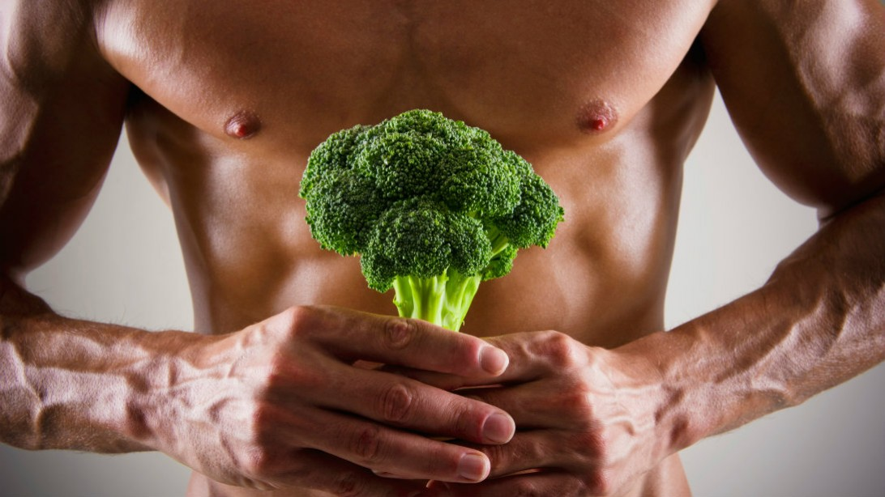
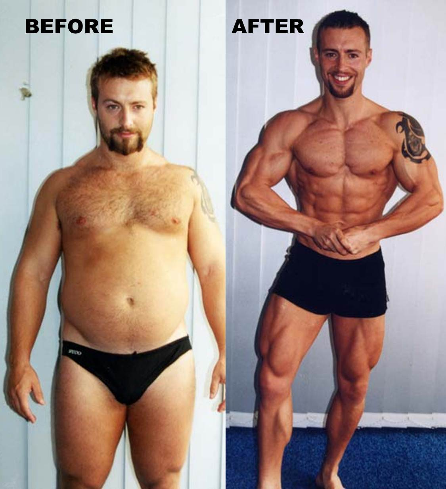

### BODYBUILDING 
---

### Bodybuilding 101
1. Story of Bodybuilding <!-- .element: class="fragment" -->
2. 5 myths about Bodybuilding <!-- .element: class="fragment" -->
3. Tips on Bodybuilding <!-- .element: class="fragment" -->

---

---

### WHAT IS BODY BUILDING
smart use of progressive resistance exercise for controlling and developing one's musculature. <!-- .element: class="fragment" -->

---

### HOW DID IT BECOME A THING?

---

### 1880 - 1985

---

### late 19th century

---

### 20th century

 <!-- .element: class="fragment" -->  <!-- .element: class="fragment" -->

---

### 2013
 <!-- .element: class="fragment" -->

---

### WHY BODYBUILDING?

---
### Reason 1: Happiness
 <!-- .element: class="fragment" --> 

---

### Reason 2: Your Marriage
 <!-- .element: class="fragment" --> 

---
### Reason 3: Mind
 <!-- .element: class="fragment" -->

---

## Common Body-building Myths

---

---

### Myth

You can't gain muscle by eating vegetables

+++

**Requirements to gain muscles**

- Stimulus(Workout)
- Nutrients
- Calories

+++

### False

Vegetables contain all the nutrients and calories needed

+++

### In fact

Vegetable calories are more slowly digested

Give you required energy without elevated blood sugar

---

---

### Myth

You lose muscle if you don't workout

+++

Why do we need to workout in the first place?

+++

### Process of Muscle Creation

1. Person works out <!-- .element: class="fragment" -->
2. Body thinks <!-- .element: class="fragment" -->
2. We are doing strenous activty! <!-- .element: class="fragment" -->
2. We need to create more muscle! <!-- .element: class="fragment" -->
3. Body generates muscles from stores of nutrients/proteins <!-- .element: class="fragment" -->

+++

### True

Without stimulus from workout <!-- .element: class="fragment" -->

Body will convert muscle to fat <!-- .element: class="fragment" -->

---

### Myth

You can workout to get your desired muscle shape

+++

### False

Muscle shape is determined by genetics

+++

### However

You can reduce fat covering the muscles

to get desired body proportions

---

### Myth

If you aren't sore the next day,

your workout was not hard enough

+++

### False

Soreness -> Your muscles are lengthened more than they are used to

+++

Usually happens after :

1. A long hiatus
2. Trying a new workout

+++

No soreness when your muscles are used to a workout

+++

Your workout effectiveness is measured by:

1. Actual muscle mass gained
2. Fat loss

---

### Myth

More muscles makes you stronger

+++

### False

Muscle Size != Muscle Strength

+++

### Generally

* Body Builders: Bigger Muscles
* Athletes: Stronger Muscles

+++

### Strong muscles

Able to exert more force in shorter period

+++?image=assets/myth5-1.jpg

+++?image=assets/myth5-2.jpg

---

### Some tips for bodybuilding

---

### Resting
 
Rule of thumb: If you're too exhausted, don't force yourself.

---

### Warming up

- Warm up: loosen muscles
- Stretching: increase flexibility

---

- Examples of warm up:
   - Runner: light jog.
   - Martial arts: few light kicks and punches. 
   - Bodyweight workouts: basic body rotations. 
   - Lift weight: do a few lifts with very light weights.

---

### Dieting/Macro
Know the number of grams of carb, protein and fat you consume

---

### Some simple rules
- don't eat too much carbohydrates when you don't need it
- cardio workout before breakfast
- don't starve

---
### Tracking

Weight gained! But muscles or fat?
 

---

### Why tracking?
to know you're on the right track (pun not intended)

---

### What to track?
- Your body size (selfie <3)
- Your body size (exact measurement)
- The weights that you have lifted
- No. of reps
- Diet 

---

### Overall
- Resting
- Warming up <!-- .element: class="fragment" -->
- Tracking <!-- .element: class="fragment" -->
- Dieting <!-- .element: class="fragment" -->

