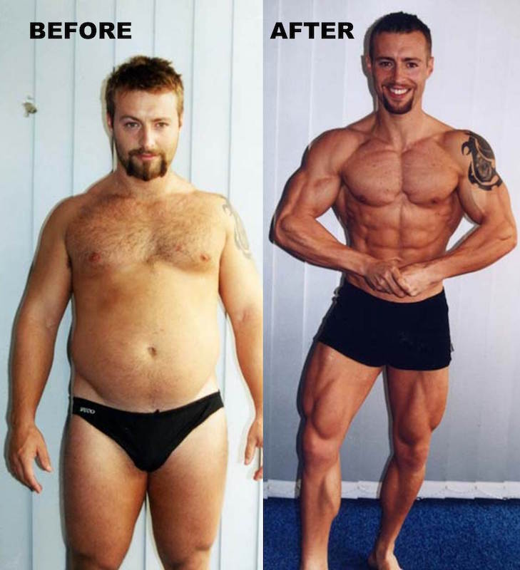

## Common Body-building Myths

---

---

### Myth

You can't gain muscle by eating vegetables

+++

**Requirements to gain muscles**

- Stimulus(Workout)
- Nutrients
- Calories

+++

### False

Vegetables contain all the nutrients and calories needed

+++

### In fact

Vegetable calories are more slowly digested

Give you required energy without elevated blood sugar

---

---

### Myth

You lose muscle if you don't workout

+++

Why do we need to workout in the first place?

+++

### Process of Muscle Creation

1. Person works out <!-- .element: class="fragment" -->
2. Body thinks <!-- .element: class="fragment" -->
2. We are doing strenous activty! <!-- .element: class="fragment" -->
2. We need to create more muscle! <!-- .element: class="fragment" -->
3. Body generates muscles from stores of nutrients/proteins <!-- .element: class="fragment" -->

+++

### True

Without stimulus from workout <!-- .element: class="fragment" -->

Body will convert muscle to fat <!-- .element: class="fragment" -->

---

### Myth

You can workout to get your desired muscle shape

+++

### False

Muscle shape is determined by genetics

+++

### However

You can reduce fat covering the muscles

to get desired body proportions

---

### Myth

If you aren't sore the next day,

your workout was not hard enough

+++

### False

Soreness -> Your muscles are lengthened more than they are used to

+++

Usually happens after :

1. A long hiatus
2. Trying a new workout

+++

No soreness when your muscles are used to a workout

+++

Your workout effectiveness is measured by:

1. Actual muscle mass gained
2. Fat loss

---

### Myth

More muscles makes you stronger

+++

### False

Muscle Size != Muscle Strength

+++

### Generally

* Body Builders: Bigger Muscles
* Athletes: Stronger Muscles

+++

### Strong muscles

Able to exert more force in shorter period

+++?image=assets/myth5-1.jpg

+++?image=assets/myth5-2.jpg

